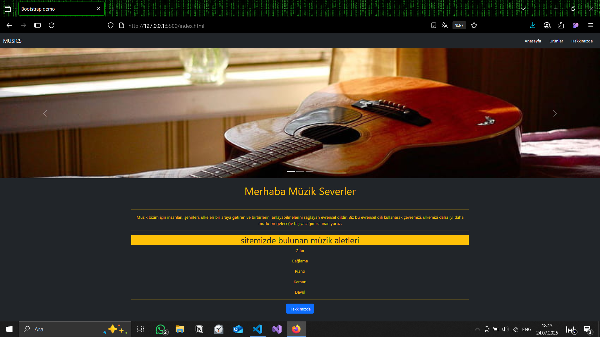
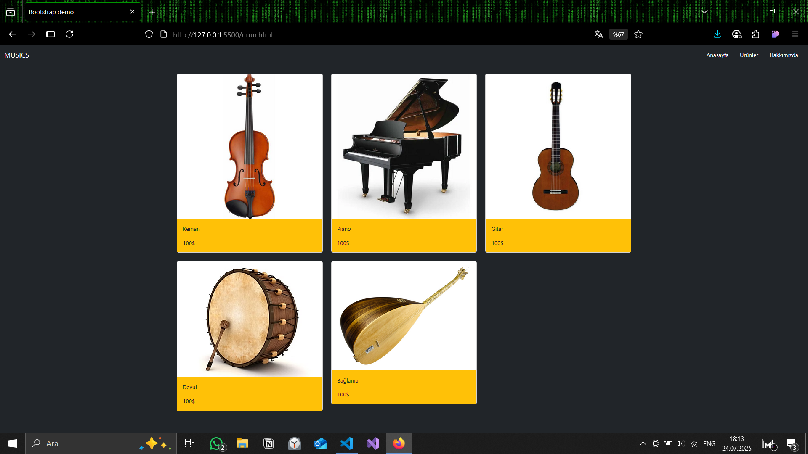
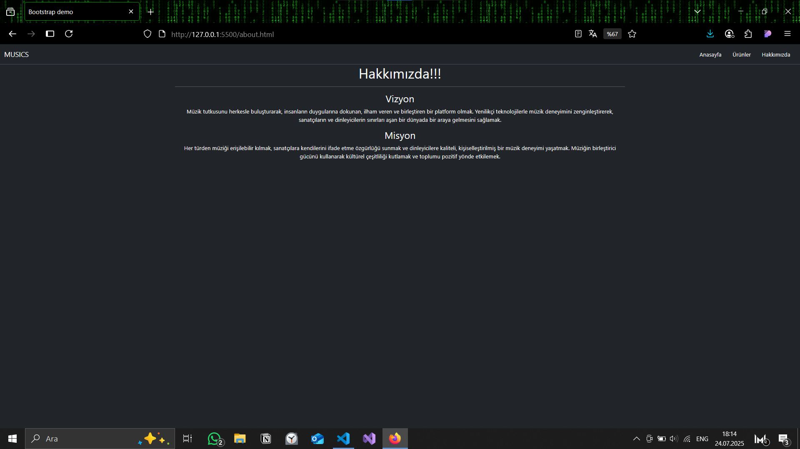

# Musics sitesi

Bu projede bir müzik dükkanının internet sayfası düzenlendi.

## İçerik

- HTML5
- CSS3
- Bootstrap
- Responsive'dir

## Nasıl Çalıştırılır?

1. Projeyi bilgisayarınıza indirin.
2. index.html dosyasını bir tarayıcıda açın.

## Ekran Görüntüsü

## Lisans

Bu proje [MIT Lisansı](LICENSE) ile lisanslanmıştır.
